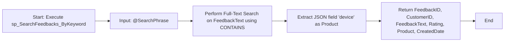
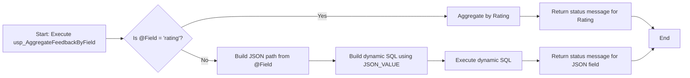
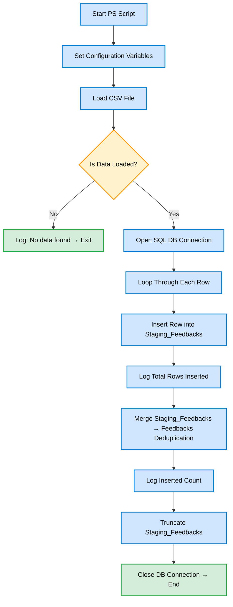

# Customer Feedback Analysis Project (SQL-Based)
Analyze customer feedback using T-SQL with fast queries, smart JSON parsing, and sentiment tagging all in a performance-tuned SQL Server setup.

## Project Structure 

```
sql-database-project/
│
├── ddl/
│  ├── 1.Customers.sql
│  ├── 2.Feedbacks.sql
│  └── 3.Staging_Feedbacks.sql
├── fulltext/
│  └── 4.Create_fulltext_catalog.sql
│  dml/demo_data
│  ├── 5.Insert_customers.sql
│  ├── 6.Insert_feedbacks.sql
│  ├── 7.feedback_data.csv
│  ├── 8.Generate_Feedback_Data_Powershell_Script.ps1
├── indexes/
│  └── 9.Create_Index_Feedbacks.sql
├── procedures/
│  ├── 10.dbo.sp_AggregateFeedbacks_By_MetadataAndSentiment.sql
│  ├── 11.dbo.sp_SearchFeedbacks_ByKeyword.sql
│  └── 12.dbo.usp_AggregateFeedbackByField.sql
├── queries/
│  └── External_Source_Performance_Tuning_queries.sql
├── README.md

```
## Features

- Load and analyze customer feedback records
- Extract sentiment from feedback text (positive/negative classification)
- Parse and aggregate JSON fields (e.g., `device`, `location`)
- Use dynamic SQL for flexible analysis
- Optimize queries with smart indexing strategies
- Integrate with [Brent Ozar’s](https://www.brentozar.com/) tools like `sp_BlitzIndex` and `sp_BlitzCache` for performance tuning.

## Querying - Reporting
### Search feedbacks for keywords/phrases (Full-Text Search)
```sql
    SELECT 
        FeedbackID,
        CustomerID,
        FeedbackText,
        Rating,
        JSON_VALUE(Metadata, '$.device') AS Product,
        CreatedDate
    FROM dbo.Feedbacks
    WHERE CONTAINS(FeedbackText, @SearchPhrase);

```
### Stored Procedure Logic: sp_SearchFeedbacks_ByKeyword


### Aggregate feedback by rating, product, or other JSON fields
```sql
EXEC dbo.usp_AggregateFeedbackByField @Field = 'rating';
EXEC dbo.usp_AggregateFeedbackByField @Field = 'device';
EXEC dbo.usp_AggregateFeedbackByField @Field = 'location';
EXEC dbo.usp_AggregateFeedbackByField @Field = 'browser';
```
### Stored Procedure Logic: usp_AggregateFeedbackByField



### Filter/aggregate feedbacks by JSON metadata (e.g., product, sentiment)
```sql
SELECT 
    JSON_VALUE(Metadata, '$.device') AS Product,
    Sentiment,
    COUNT(*) AS FeedbackCount,
    ROUND(AVG(CAST(Rating AS FLOAT)), 2) AS AvgRating
FROM #FeedbackTemp
GROUP BY Product, Sentiment;
```
### Stored Procedure Logic: sp_AggregateFeedbacks_By_MetadataAndSentiment


### Import feedback data from CSV/JSON into the database


### PowerShell Script Flowchart


### Indexing Strategy
To optimize frequent filtering, aggregation, and search operations:
1. **Clustered Index:** 
    - FeedbackID
2. **Non-Clustered Indexes:**
    - Rating
    - CreatedDate + Rating 
    - CustomerID + CreatedDate (with includes)

Indexes are created only if they don't already exist using IF NOT EXISTS logic

### Performance Tools
1. **Included:**
    - `sp_BlitzIndex` – Identify missing or unused indexes
    - `sp_BlitzCache` – Detect slow-running queries
      
These scripts are available in the queries/ThirdParty_performancetuning.sql file.

### How to Run 
    1. Open SSMS and connect to your SQL Server instance
    2. Create the database:

```sql
CREATE DATABASE CustomerFeedback;
USE CustomerFeedback;
```
3. Run ddl, dml, fulltext folder scripts 
4. Execute analysis and Group by scripts
5. Review stored procedures performance using `sp_BlitzIndex` and `sp_BlitzCache`
---

## Use Cases (Based on Project Requirements)
This project is designed to demonstrate practical and advanced SQL Server capabilities aligned with real-world enterprise needs:

### 1. Search Feedbacks for Keywords/Phrases
- Utilize **Full-Text Search** for efficient retrieval of customer feedbacks containing specific keywords or phrases.
- Enables quick identification of positive or negative sentiment based on text content.

### 2. Filter and Aggregate Using JSON Metadata
- Leverage `JSON_VALUE()` to extract fields (like `device`, `location`, etc.) from JSON metadata.
- Enable dynamic filtering and grouping based on flexible metadata fields without schema changes.

### 3. Aggregate Feedback by Rating, Product, or JSON Fields
- Perform grouping and aggregation based on both traditional columns (like `Rating`) and JSON properties.
- Useful for deriving high-level insights (e.g., average rating by product or location).

### 4. Database Normalization and Indexing
- Ensure normalized schema design with appropriate use of **clustered** and **non-clustered indexes**.
- Avoid performance bottlenecks by indexing search and filter fields, including JSON-based access paths.

### 5. Script Quality and Idempotency
- Scripts follow **best practices** in terms of safety:
  - `IF NOT EXISTS` conditions to avoid re-creation errors.
  - Consistent naming and modular approach.
  - Reusable stored procedures for dynamic analysis.

### 6. Error Handling & Defensive SQL
- Dynamic SQL is properly sanitized to avoid injection and syntax issues.
- Error messages and execution statuses are returned clearly.

### 7. Automation & DevOps Mindset
- Ready for integration into DevOps pipelines:
  - Organized folder structure
  - Versioned scripts
  - Reproducible from source control

### 8. Query Performance and Clarity
- Queries are written with:
  - Clear structure and indentation
  - Execution plans tested with `sp_BlitzCache`
  - Index usage reviewed with `sp_BlitzIndex`

### 9. Documentation & Code Readability
- Code is clean, commented, and readable.
- Documentation includes clear explanations of logic and transformation steps.
- Easy for new developers or reviewers to understand and extend.
---

## Tools Used
- SQL Server 2022
- Git / GitHub
- SQL Server Management Studio (SSMS)
---

## CI/CD Deployment
This project uses GitHub Actions to auto-deploy SQL database scripts to your target SQL Server (Azure SQL or On-Prem).

### Prerequisites
- Add the following repository secrets:
  - `SQL_SERVER`
  - `SQL_USER`
  - `SQL_PASSWORD`
  - `SQL_DATABASE`

## Author
Abdul Samath
